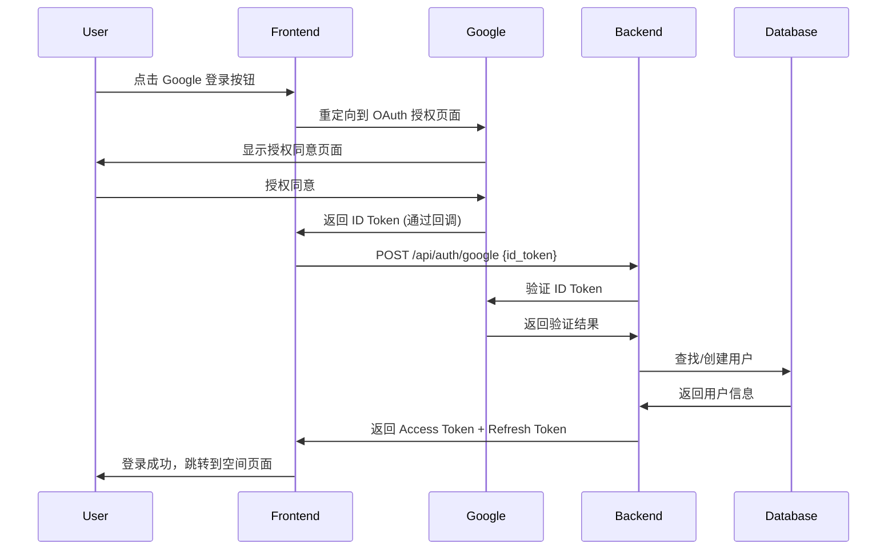
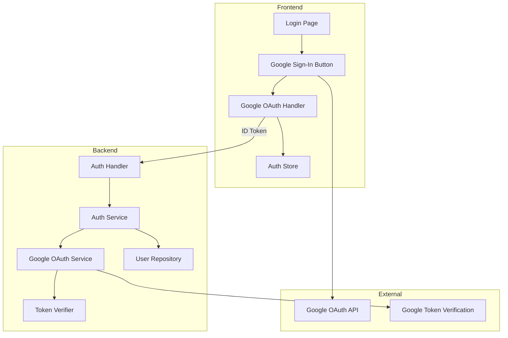

# Design Document: Google Login

## Overview

本设计文档描述了 LineTime 应用集成 Google OAuth 2.0 登录的技术方案。采用前端发起 OAuth 流程、后端验证 ID Token 的架构模式，确保安全性和用户体验的平衡。

## Architecture

### 认证流程



### 系统架构



## Components and Interfaces

### Backend Components

#### 1. Google OAuth Configuration

```go
// config/config.go
type GoogleOAuthConfig struct {
    ClientID     string
    ClientSecret string
}
```

#### 2. Google OAuth Service

```go
// internal/service/google_oauth_service.go
type GoogleOAuthService struct {
    clientID string
}

type GoogleUserInfo struct {
    Sub           string `json:"sub"`           // Google 用户唯一 ID
    Email         string `json:"email"`
    EmailVerified bool   `json:"email_verified"`
    Name          string `json:"name"`
    Picture       string `json:"picture"`
}

func (s *GoogleOAuthService) VerifyIDToken(idToken string) (*GoogleUserInfo, error)
```

#### 3. Auth Service Extension

```go
// internal/service/auth_service.go
type GoogleLoginRequest struct {
    IDToken string `json:"id_token" binding:"required"`
}

func (s *AuthService) GoogleLogin(req *GoogleLoginRequest) (*AuthResponse, error)
```

#### 4. User Model Extension

```go
// internal/model/user.go
type User struct {
    // ... existing fields
    GoogleID     *string `gorm:"type:varchar(255);uniqueIndex" json:"-"`
    AuthProvider string  `gorm:"type:varchar(20);default:'local'" json:"auth_provider"`
}
```

### Frontend Components

#### 1. Google Sign-In Integration

使用 Google Identity Services (GIS) 库实现前端 OAuth 流程。

```typescript
// lib/api/auth.ts
interface GoogleLoginRequest {
  id_token: string;
}

googleLogin: async (idToken: string) => {
  const response = await apiClient.post<AuthResponse>('/auth/google', { id_token: idToken });
  // ... handle response
}
```

#### 2. Login Page Enhancement

```typescript
// app/login/page.tsx
const handleGoogleSignIn = async (credential: string) => {
  await googleLogin(credential);
  // ... redirect logic
}
```

### API Endpoints

| Method | Endpoint | Description | Auth Required |
|--------|----------|-------------|---------------|
| POST | `/api/auth/google` | Google OAuth 登录 | No |

#### Request/Response

**POST /api/auth/google**

Request:
```json
{
  "id_token": "eyJhbGciOiJSUzI1NiIsInR5cCI6IkpXVCJ9..."
}
```

Response (Success):
```json
{
  "code": 200,
  "message": "success",
  "data": {
    "user": {
      "id": "uuid",
      "email": "user@gmail.com",
      "username": "user",
      "avatar_url": "https://...",
      "auth_provider": "google"
    },
    "access_token": "...",
    "refresh_token": "...",
    "expires_in": 7200
  }
}
```

## Data Models

### User Model Changes

| Field | Type | Description |
|-------|------|-------------|
| google_id | VARCHAR(255) | Google 用户唯一标识 (sub claim) |
| auth_provider | VARCHAR(20) | 认证提供商: 'local' 或 'google' |

### Database Migration

```sql
ALTER TABLE users ADD COLUMN google_id VARCHAR(255) UNIQUE;
ALTER TABLE users ADD COLUMN auth_provider VARCHAR(20) DEFAULT 'local';
CREATE INDEX idx_users_google_id ON users(google_id);
```

## Correctness Properties

*A property is a characteristic or behavior that should hold true across all valid executions of a system-essentially, a formal statement about what the system should do. Properties serve as the bridge between human-readable specifications and machine-verifiable correctness guarantees.*

### Property 1: Existing User Google Login Authentication

*For any* existing user with a matching email, when signing in via Google, the system should authenticate the user and return valid tokens without creating a duplicate account.

**Validates: Requirements 1.3, 1.5**

### Property 2: New User Account Creation from Google Profile

*For any* Google user profile (email, name, picture), when the user signs in and no matching account exists, the system should create a new account where:
- The user email matches the Google email
- The username is derived from the email prefix
- The avatar URL matches the Google profile picture

**Validates: Requirements 1.4, 2.1, 2.2, 2.3**

### Property 3: Username Uniqueness on Conflict

*For any* username conflict during Google account creation, the system should generate a unique username by appending a suffix, ensuring no duplicate usernames exist.

**Validates: Requirements 2.4**

### Property 4: ID Token Validation

*For any* Google ID Token submitted for authentication:
- Valid tokens with correct audience should be accepted
- Invalid, expired, or wrong-audience tokens should be rejected with an error

**Validates: Requirements 3.2, 3.3, 3.4**

## Error Handling

| Error Scenario | HTTP Status | Error Message |
|----------------|-------------|---------------|
| Invalid ID Token | 401 | "Google 认证失败：无效的令牌" |
| Token Expired | 401 | "Google 认证失败：令牌已过期" |
| Wrong Audience | 401 | "Google 认证失败：令牌验证失败" |
| Email Not Verified | 400 | "请使用已验证的 Google 邮箱" |
| Server Error | 500 | "服务器错误，请稍后重试" |

## Testing Strategy

### Property-Based Testing

使用 Go 的 `testing/quick` 或 `gopter` 库进行属性测试。

**测试框架**: 
- Backend: Go `testing` + `gopter` for property-based testing
- Frontend: Jest + React Testing Library

**Property Tests**:
1. 现有用户 Google 登录认证测试
2. 新用户账户创建测试
3. 用户名冲突处理测试
4. ID Token 验证测试

### Unit Tests

1. `GoogleOAuthService.VerifyIDToken` - Token 验证逻辑
2. `AuthService.GoogleLogin` - 登录流程逻辑
3. Username 生成和冲突处理逻辑
4. 前端 Google Sign-In 回调处理

### Integration Tests

1. 完整的 Google OAuth 登录流程 (使用 mock)
2. 数据库用户创建和查询
3. Token 生成和验证

