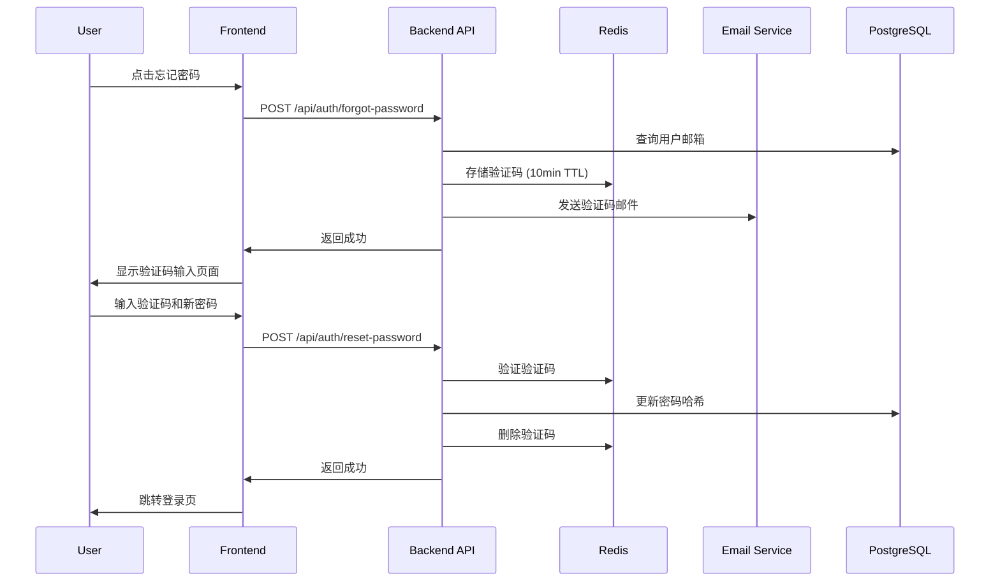

# Design Document: Password Reset and Change

## Overview

本设计文档描述密码重置和修改密码功能的技术实现方案。系统将支持两种密码操作：
1. **忘记密码重置**：通过邮箱验证码验证身份后重置密码
2. **修改密码**：已登录用户验证当前密码后修改新密码

系统使用 Redis 存储临时验证码，确保高效的过期管理和并发安全。

## Architecture



## Components and Interfaces

### Backend Components

#### 1. Password Reset Service (`internal/service/password_reset_service.go`)

```go
type PasswordResetService struct {
    userRepo    *repository.UserRepository
    redisClient *redis.Client
    emailSender EmailSender
}

// RequestPasswordReset generates and sends verification code
func (s *PasswordResetService) RequestPasswordReset(email string) error

// VerifyAndResetPassword verifies code and updates password
func (s *PasswordResetService) VerifyAndResetPassword(email, code, newPassword string) error

// ChangePassword changes password for logged-in user
func (s *PasswordResetService) ChangePassword(userID uuid.UUID, currentPassword, newPassword string) error
```

#### 2. Password Reset Handler (`internal/api/auth/handler.go` 扩展)

新增 API 端点：
- `POST /api/auth/forgot-password` - 请求密码重置
- `POST /api/auth/reset-password` - 验证码验证并重置密码
- `POST /api/auth/change-password` - 修改密码（需认证）

#### 3. Email Service Interface (`internal/service/email_service.go`)

```go
type EmailSender interface {
    SendVerificationCode(to, code string) error
}

type SMTPEmailService struct {
    host     string
    port     int
    username string
    password string
    from     string
}
```

### Frontend Components

#### 1. Forgot Password Page (`app/forgot-password/page.tsx`)
- 邮箱输入表单
- 验证码输入表单
- 新密码设置表单

#### 2. Change Password Component (`app/settings/change-password/page.tsx`)
- 当前密码输入
- 新密码输入
- 确认新密码输入

#### 3. API Client Extensions (`lib/api/auth.ts`)
```typescript
// 请求密码重置
forgotPassword: (email: string) => Promise<ApiResponse>

// 重置密码
resetPassword: (email: string, code: string, newPassword: string) => Promise<ApiResponse>

// 修改密码
changePassword: (currentPassword: string, newPassword: string) => Promise<ApiResponse>
```

## Data Models

### Password Reset Token (Redis)

```go
type PasswordResetToken struct {
    Email     string    `json:"email"`
    Code      string    `json:"code"`
    Attempts  int       `json:"attempts"`
    CreatedAt time.Time `json:"created_at"`
    ExpiresAt time.Time `json:"expires_at"`
}
```

Redis Key 格式: `password_reset:{email}`
TTL: 10 分钟

### Request/Response DTOs

```go
// ForgotPasswordRequest
type ForgotPasswordRequest struct {
    Email string `json:"email" binding:"required,email"`
}

// ResetPasswordRequest
type ResetPasswordRequest struct {
    Email       string `json:"email" binding:"required,email"`
    Code        string `json:"code" binding:"required,len=6"`
    NewPassword string `json:"new_password" binding:"required,min=8"`
}

// ChangePasswordRequest
type ChangePasswordRequest struct {
    CurrentPassword string `json:"current_password" binding:"required"`
    NewPassword     string `json:"new_password" binding:"required,min=8"`
}
```

## Correctness Properties

*A property is a characteristic or behavior that should hold true across all valid executions of a system-essentially, a formal statement about what the system should do. Properties serve as the bridge between human-readable specifications and machine-verifiable correctness guarantees.*

### Property 1: Verification Code Format
*For any* password reset request with a valid registered email, the generated verification code SHALL be exactly 6 numeric digits.
**Validates: Requirements 1.1**

### Property 2: Valid Code Acceptance
*For any* verification code that is within its 10-minute validity window and has fewer than 5 failed attempts, the system SHALL accept the code when it matches the stored code.
**Validates: Requirements 1.2**

### Property 3: Password Update with Correct Current Password
*For any* logged-in user with a local password, when the provided current password matches the stored hash, the system SHALL successfully update to the new password.
**Validates: Requirements 2.1**

### Property 4: Invalid Password Rejection
*For any* password change request where the current password does not match OR the new password fails strength validation, the system SHALL reject the request.
**Validates: Requirements 2.2, 2.3**

### Property 5: Password Strength Validation
*For any* string, the password validation function SHALL return true if and only if the string has at least 8 characters AND contains at least one letter AND contains at least one number.
**Validates: Requirements 3.2**

### Property 6: Bcrypt Hash Format
*For any* password stored by the system, the resulting hash SHALL be a valid bcrypt hash string (starting with "$2a$" or "$2b$").
**Validates: Requirements 3.1**

### Property 7: Code Invalidation After Password Change
*For any* successful password reset or change operation, all existing verification codes for that user SHALL be invalidated (deleted from Redis).
**Validates: Requirements 3.3**

### Property 8: Email Masking
*For any* email address, the masking function SHALL hide characters while preserving the first character, domain, and a recognizable pattern (e.g., "t***@example.com").
**Validates: Requirements 4.1**

### Property 9: Token Serialization Round Trip
*For any* valid PasswordResetToken object, serializing to JSON and then deserializing SHALL produce an equivalent token object.
**Validates: Requirements 5.3**

## Error Handling

### Error Codes and Messages

| Error Code | HTTP Status | Message | Scenario |
|------------|-------------|---------|----------|
| `EMAIL_NOT_FOUND` | 404 | 该邮箱未注册 | 邮箱不存在 |
| `GOOGLE_ONLY_ACCOUNT` | 400 | 该账户使用 Google 登录，请使用 Google 登录 | Google 账户尝试重置密码 |
| `CODE_EXPIRED` | 400 | 验证码已过期，请重新获取 | 验证码超过10分钟 |
| `CODE_INVALID` | 400 | 验证码错误 | 验证码不匹配 |
| `TOO_MANY_ATTEMPTS` | 429 | 尝试次数过多，请重新获取验证码 | 超过5次错误尝试 |
| `RATE_LIMITED` | 429 | 请求过于频繁，请 {n} 秒后重试 | 短时间内多次请求 |
| `CURRENT_PASSWORD_WRONG` | 400 | 当前密码错误 | 修改密码时当前密码不对 |
| `PASSWORD_TOO_WEAK` | 400 | 密码必须至少8位，包含字母和数字 | 新密码不符合要求 |
| `NO_PASSWORD_SET` | 400 | 您尚未设置密码，请先设置密码 | Google 用户尝试修改密码 |

### Rate Limiting Strategy

- 同一邮箱请求验证码：每分钟最多 1 次
- 验证码验证尝试：每个验证码最多 5 次
- 全局 IP 限制：每小时最多 10 次密码重置请求

## Testing Strategy

### Property-Based Testing

使用 Go 的 `testing/quick` 包或 `gopter` 库进行属性测试：

1. **验证码格式测试**：生成随机邮箱，验证生成的验证码格式
2. **密码强度验证测试**：生成随机字符串，验证密码验证逻辑
3. **Token 序列化测试**：生成随机 Token，验证序列化/反序列化一致性
4. **邮箱掩码测试**：生成随机邮箱，验证掩码格式

### Unit Tests

1. **Service 层测试**
   - 验证码生成和存储
   - 密码重置流程
   - 密码修改流程
   - 错误处理

2. **Handler 层测试**
   - 请求参数验证
   - 响应格式验证
   - 认证中间件集成

### Integration Tests

1. 完整的密码重置流程测试
2. 完整的密码修改流程测试
3. Redis 连接和操作测试

### Testing Framework

- 后端：Go 标准 `testing` 包 + `gopter` (属性测试)
- 前端：Jest + React Testing Library
